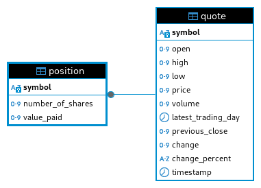

# Introduction
(50-100 words)
What does this app do? What technoglies your have used? (JDBC, PSQL, MVN, etc..)
A Java Stock Quote command-line application that allows users to simulate a personal Stock Wallet. An external 
API is integrated into the application to fetch real-time stock data, ensuring up-to-date information.
Technologies utilized in this project include JDBC for database interactions, PostgreSQL for the database 
management system, Maven for application dependency management and project building, additionally Docker
is used for containerization and distribution.

# Implementaiton
## ER Diagram

## Design Patterns
Discuss DAO and Repository design patterns (150-200 words)
This project utilizes Data Access Object (DAO) and Repository design patterns. The DAO pattern focuses on encapsulating 
the data access logic and separating it from the business logic. It provides a way to perform Create, Read, Update,
Delete (CRUD) operations on data sources with external storage, such as databases, REST APIs, file systems, etc.
Both Quote and Position entities implement their own DAO classes which leverage common a common interface and contain 
corresponding methods to facilitate the CRUD operations. This approach ensures a clean, modular structure, making the 
application more maintainable and easier to extend with additional features in the future.

# Test
How you test your app against the database? (e.g. database setup, test data set up, query result)
