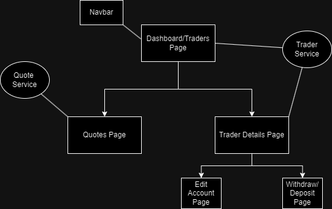

# Introduction
A trading information system designed to facilitate interaction between traders and their financial data through a user-friendly interface. It allows traders and financial administrators to view essential information including a list of all traders, daily quotes, and detailed profiles of specific traders. Users can also create new traders as well as manage their accounts by editing info or making deposits/withdrawals. The frontend application is developed using TypeScript and the Angular 16 ensuring a responsive and dynamic user experience.

# Quick Start
- Install and start docker
- Pull docker image

  ```
  docker pull mm444/angular-trading-ui
  ```

- Start up mock backend API on port 3004 using db.json file

  ```
  npm install json-server
  json-server --watch db.json
  ```

- Run docker image

  ```
  docker run --rm -v ${PWD}:/app -v /app/node_modules -p 4201:4200 mm444/angular-trading-ui
  ```

# Implemenation
### Services:

  Implemented Angular services for Traders and Quotes to interact with the backend APIs, utilizing HttpClient for API requests.

### Components:

  Developed components for displaying lists of traders and quotes, as well as creating new traders. Utilized Angular Material components, such as tables and forms, for a consistency.

### Routing:

  Set up Angular routing to navigate between different views, such as the trader list, quote list and trader details.

## Architecture


# Test
The application runs unit tests with the Jasmine testing framework to ensure functionality. Additionally, application flow is logged to improve debugging efficiency.

# Deployment
The applications source code is managed on GitHub to streamline version control. Docker was employed to containerize the application, ensuring consistent environments across development, testing, and production.

# Improvements
Write at least three things you want to improve 
e.g. 
- Handle the adding and removing of quotes
- Add pagination/filtering for large datasets
- Add inputdata validation