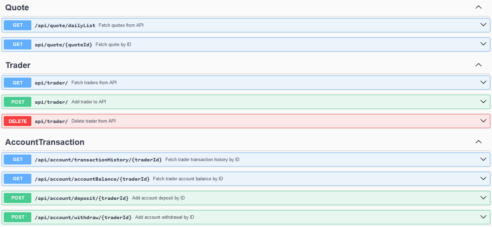

 # Introduction
This project creates backend for a trading system, providing various functionalities to manage traders and their transactions. The backend is built using Node.js with the Express framework, and MySQL is used for persisting data. The application offers a RESTful API that allows users to add, delete, and retrieve traders, view stock quotes, and manage trader accounts, including transaction history and account balances. Users can also perform actions like depositing and withdrawing funds. The key users are traders who will interact with the frontend to perform actions like checking stock quotes, managing their account balances, and tracking their transaction history.

# Quick Start
- Ensure MySQL and Docker are setup
- Pull docker image
  ```
  docker pull mm444/node-trading-app
  ```
- Run docker image
  ```
    docker run --rm -p 3001:3001 mm444/node-trading-app
  ```


# Implemenation

## Models

#### Trader:
```
id	integer($int32)
## Unique identifier for the trader

firstName	string
## Trader's first name

lastName  string
## Trader's last name

email string
## Trader's email address
dob	string($date)
## Trader's date of birth

country string
## Trader's country of residence
```

#### Quote:
```
ticker	string
## Stock symbol representing the quote

last_price	number($double)
## The last price of the stock

bid_price	number($double)
## The bid price for the stock

bid_size	number($double)
## The bid size for the stock

ask_price	number($double)
## The ask price for the stock

ask_size	number($double)
## The ask size for the stock
```

#### Transaction: 
```
id	integer($int32)
## Unique identifier for the trader

firstName	string
## Trader's first name

lastName	string
## Trader's last name

email	string
## Trader's email address

dob	string($date)
## Trader's date of birth

country	string
## Trader's country of residence
```

### Routes


# Test
The application was tested thoroughly using Postman to simulate HTTP requests (GET, POST, PUT, DELETE) and ensure the CRUD operations for traders, transactions, and other resources worked correctly. I configured requests with appropriate headers and body data, checking for correct responses and error handling. Additionally, I used console logging in Node.js to track data flow and debug issues, especially during database interactions with MySQL.

# Deployment
The application was deployed using Docker, creating a containerized environment that packages the backend and its dependencies for consistent deployment across different platforms. The source code is managed on GitHub, where version control is handled.

# Improvements
Write at least three things you want to improve 
e.g. 
- Handle the adding/removing of Quotes
- Incorporate Sequelize transaction support for the AccountTransaction model
- Include further data validation