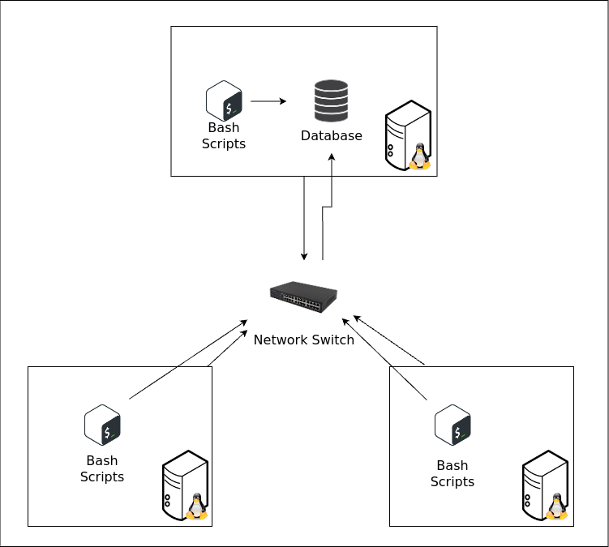

# Linux Cluster Monitoring Agent

## Introduction

The Linux Cluster Administration (LCA) team manages a 10-node Rocky Linux 9 
cluster, which is interconnected via a network switch using internal IPv4 addresses. 
The team aims to collect and store data related to each clusters specifications and
resource usage (e.g. CPU, memory) in order facilitate real-time monitoring of the 
clusters. The information, stored in a relational database, can then be used by the 
LCA team to generate reports for future resource planning, such as adding or 
removing servers.

This project allows the LCA to accomplish the outlined task through various bash
scripts that interact with Docker containerization, PostgreSQL RDBMS and cron.

## Quick Start

- Start a psql instance using `psql_docker.sh`

    ```
    ./scripts/psql_docker.sh start|stop|create [db_username][db_password]
    ```
  
- Create tables using `ddl.sql`

    ```
    psql -h <psql_host> -p <psql_port> -d <db_name> -U <psql_user> -f ./sql/ddl.sql
    ```
  
- Insert hardware specs data into the DB using `host_info.sh`

    ```
    ./scripts/host_info.sh <psql_host> <psql_port> <db_name> <psql_user> <psql_password>
    ```
  
- Insert hardware usage data into the DB using `host_usage.sh`

    ```
    ./scripts/host_usage.sh <psql_host> <psql_port> <db_name> <psql_user> <psql_password>
    ```
  
- Crontab setup

    ```
    crontab -e
    # The following line runs the host_usage.sh script every minute
    * * * * * /path/to/scripts/host_usage.sh <psql_host> <psql_port> <db_name> <psql_user> <psql_password>
    ```

## Implementation

### Architecture



### Scripts

#### psql_docker.sh

This script can start or stop a containerized psql instance or create a psql instance if not created.

```
./scripts/psql_docker.sh start|stop|create [db_username][db_password]
```

`start|stop|create` - start/stop/create the psql instance

`db_username` - psql database username

`db_password` - psql database password

#### ddl.sql

This script creates database tables for host spec info and host usage info
if they do not already exist. Note: This script assumes that the database `db_name` 
was already created.

```
psql -h <psql_host> -p <psql_port> -d <db_name> -U <psql_user> -f ./sql/ddl.sql
```

`psql_host` - psql hostname

`psql_port` - psql port number (`5432`)

`psql_user` - psql username

`db_name` - database name

#### host_info.sh

This script retrieves a new hosts hardware specs and inserts to the host_info table
of the database.

```
./scripts/host_info.sh <psql_host> <psql_port> <db_name> <psql_user> <psql_password>
```

`psql_host` - psql hostname

`psql_port` - psql port number (`5432`)

`psql_user` - psql username

`db_name` - database name

`psql_password` - database password

#### host_usage.sh

This script retrieves a hosts hardware usage information and inserts it as log to
the host_usage table of the database.

```
./scripts/host_usage.sh <psql_host> <psql_port> <db_name> <psql_user> <psql_password>
```

`psql_host` - psql hostname

`psql_port` - psql port number (`5432`)

`psql_user` - psql username

`db_name` - database name

`psql_password` - database password

#### Crontab

This crontab configuration runs `host_usage.sh` every minute in order monitor a hosts
usage data.

```
# Edit crontab with
crontab -e

# Then input the following to run host_usage.sh every minute
* * * * * /path/to/scripts/host_usage.sh <psql_host> <psql_port> <db_name> <psql_user> <psql_password>
```

### Database Modeling
`host_info` table

| Variable         | Type       | Description             |
|------------------|------------|-------------------------|
| id               | SERIAL     | Primary key             |
| hostname         | INT2       | Hostname of the machine |
| cpu_number       | VARCHAR    | Number of CPUs          |
| cpu_architecture | VARCHAR    | CPU architecture        |
| cpu_model        | SERIAL     | CPU model               |
| cpu_mhz          | FLOAT8     | CPU speed in MHz        |
| l2_cache         | INT4       | L2 cache size in KB     |
| timestamp        | TIMESTAMP  | Timestamp of the data   |
| total_mem        | INT4       | Total memory in KB      |

`host_usage` table

| Variable       | Type      | Description                           |
|----------------|-----------|---------------------------------------|
| timestamp      | TIMESTAMP | Timestamp of the data                 |
| host_id        | SERIAL    | Foreign key referencing host_info.id  |
| memory_free    | INT4      | Free memory in MB                     |
| cpu_idle       | INT2      | CPU idle percentage                   |
| cpu_kernel     | INT2      | CPU kernel percentage                 |
| disk_io        | INT4      | Number of disk read/writes in process |
| disk_available | INT4      | Available disk space in MB            |

## Test

Each bash script can be tested as follows,

#### psql_docker.sh

After creating a psql instance ensure that the container is running using 
`docker ps -f name=jrvs-psql`.

After stopping a psql instance ensure that the container is stopped using `docker ps -a`.

The results of these two commands should provide sufficient information to test
that the script is functioning as intended.

#### ddl.sql

After running executing the ddl file for the first time, verify that two tables were
created by viewing terminal output, look for:

```
CREATE TABLE
CREATE TABLE
```

You can further verify the creation of the table in the database by running `\dt`
or to view that the contents of the tables are as intended, run 
`SELECT * FROM host_info;` and `SELECT * FROM host_usage;`

Running the ddl file subsequently will result in terminal output similar to:

```
psql:sql/ddl.sql:19: NOTICE:  relation "host_info" already exists, skipping
CREATE TABLE
psql:sql/ddl.sql:31: NOTICE:  relation "host_usage" already exists, skipping
CREATE TABLE
```

#### host_info.sh

Run the script and inspect the hardware spec info accordingly using

```
SELECT * FROM host_info;
```

#### host_usage.sh

Run the script and inspect the host usage log data accordingly using

```
SELECT * FROM host_usage;
```

## Deployment

This project uses GitHub to host the repository and GitFlow practices to maintain 
developed features.

The project was deployed utilizing a crontab to collect host usage data regularly.

Additionally, docker is used to provision a standardized PostgreSQL database
that can be interacted universally with high functionality across the LCA 
teams machines.

## Improvements

Improvements that can be made to this project include:

1. #### Handles Hardware Updates: 
    Re-implement scripts `host_info.sh` and `host_usage.sh` to dynamically handle 
    updates/upgrades to LCA team hardware.

2. #### Automated data archiving:
    Implement a system that will automatically transfer outdated host data from 
    database to archive in order to keep database up to date and clean.

3. #### Streamline script execution:
    Implement a script to tie all individual scripts together and streamline the process
    of executing this project.
   