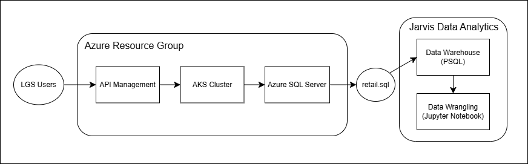

# Introduction
The project aims to assist London Gift Shop (LGS), a UK-based online retailer, in analyzing customer shopping behavior to improve marketing strategies and drive revenue growth. By examining transaction data from 01/12/2009 to 09/12/2011, the goal is to uncover insights that will enable the marketing team to create targeted campaigns, such as personalized promotions, email marketing, and events, for both new and existing customers. The analytics are performed using Python, Jupyter Notebook, and Pandas for data manipulation and analysis, with NumPy used for numerical computations. The extracted data undergoes an ETL process to prepare it for analysis, providing valuable insights such as customer segmentation, sales trends, and product performance, which will help LGS tailor their marketing efforts to boost engagement and sales.

# Implementation
## Project Architecture
The architecture of this project involves multiple components working together to analyze and enhance the customer shopping behavior at London Gift Shop (LGS). The LGS web app serves as the primary interface for customers to browse and purchase products, while transaction data from the app is stored in a SQL database. The LGS IT team exports this historical transaction data and shares it with the project team. The data undergoes an ETL process to remove personal information and is then analyzed.

## Data Analytics and Wrangling
[Notebook](retail_data_analytics_wrangling.ipynb)
- Through use of RFM (Recency, Frequency, Monetary) segmentation, customers can be categorized based on their how recently they have purchased, how frequently they purchase, and how much money they spend. This way targeted promotions can be designed for each segment to maximize engagement and conversions. For example, loyal customers with high RFM scores can receive exclusive rewards or early access to new products, while at-risk customers with low scores can be targeted with reactivation campaigns offering special discounts. By tailoring promotions to the specific needs and behaviors of each group, LGS can optimize marketing efforts, improve customer retention, and ultimately drive higher revenue.

# Improvements
1. Data Visualization: Introduce more detailed and interactive dashboards (using tools like Power BI or Python libraries) to present insights clearly and intuitively.
2. Incorporate Demographic Data: Enrich the dataset with demographic information (e.g., age, location, and gender) to create even more personalized marketing campaigns.
3. Integration of Real-Time Data: Include real-time transaction data to allow for more immediate insights and timely marketing interventions.